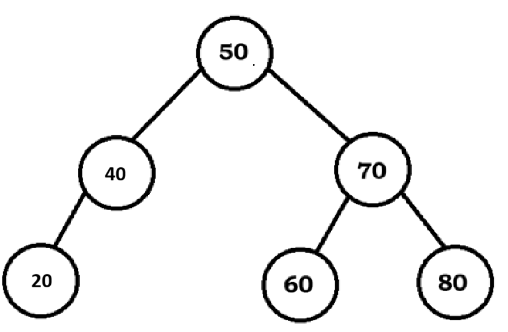
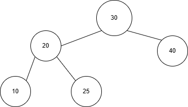
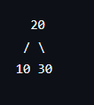
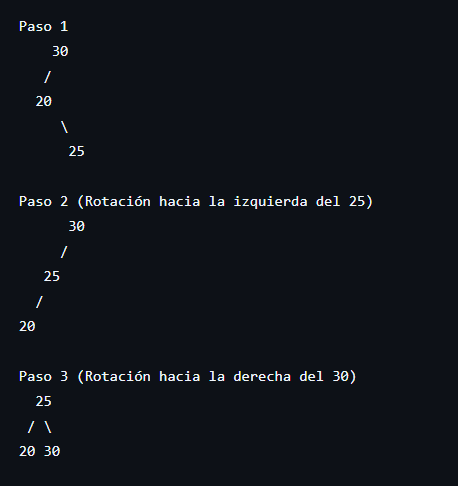
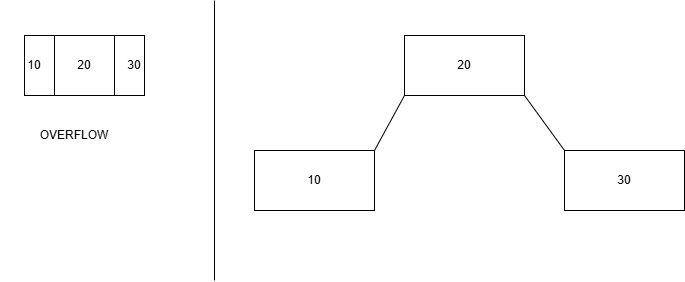

### [Consignas 🤨](Consignas_ABB.md)
## Ejercicio 1 - Construcción de ABB

1. El arbol resultante de los valores insertados al árbol vacio en orden es:
  

  

 

2. Con recorrido In-Order

Recorrido: 20 -> 30 -> 40 -> 50 -> 60 -> 70 -> 80

Altura del árbol: 2

Hojas son los nodos: 20, 40, 60, 80

## Ejercicio 2 - Traza de Búsqueda

1. La secuencia de nodos visitados en busqueda del valor "55" es: 50 -> 70 -> 60

2. La cantidad de claves comparadas es: 3

## Ejercicio 3 - Eliminación con In-Order

1. En este caso realizamos una rotación y hacemos que el 40 rote hacia el 30, el 30 cambia por el 40 y el 20 se queda en su lugar. De esta forma, se respeta el criterio in-order para poder seguir recorriendo el árbol respetando el orden y el principio.

2. El valor sucesor es el 40 y el árbol queda como en la siguiente imágen:
  

  

## Ejercicio 4 -  Factores de Balance AVL
 

  

 

Fctores de Balance:

Nodo 10 (Hoja):
bf = h(null) - h(null)
bf = -1 - (-1) = 0

Nodo 25 (Hoja):
bf = h(null) - h(null)
bf = -1 - (-1) = 0

Nodo 40 (Hoja):
bf = h(null) - h(null)
bf = -1 - (-1) = 0

Nodo 20:
Su hijo izquierdo es el 10 (altura 0). Su hijo derecho es el 25 (altura 0).
bf = h(10) - h(25)
bf = 0 - 0 = 0

Raíz 30:
Su subárbol izquierdo (el 20 y sus hijos) tiene una altura máxima de 1. Su subárbol derecho (el 40 solo) tiene altura 0.
bf = h(Izq) - h(Der)
bf = 1 - 0 = 1 

## Ejercicio 5
1. Nodo desbalanceado y su bf:  
El nodo desbalanceado es el 30, con bf = -2
2. Tipo de rotación y árbol final:  
Se aplica una Rotación Simple Derecha (RSD) en el 30 (siempre es el nodo desbalanceado). El 20 asciende como nueva raíz, el 10 queda como su hijo izquierdo y el 30 como su hijo derecho:  
 

Todos los nodos quedan con bf = 0.

## Ejercicio 6
1. Nodo desbalanceado y su bf:
El nodo desbalanceado es el 30, con bf = -2
2. Rotación doble y árbol final:
Se aplica una Rotación Doble Izquierda-Derecha (RDI) en tres pasos:

## Ejercicio 7 - TDA Árbol B: Reglas 
En un Arbol B de orden 3, sus reglas serían;
1. La capacidad máxima de datos es de 2
2. La capacidad mínima de datos es de 1

## Ejercicio 8 - Inserción en Árbol B 
(hay que poner los casilleros de cantidad maxima de datos, no como abajo)
  

  

